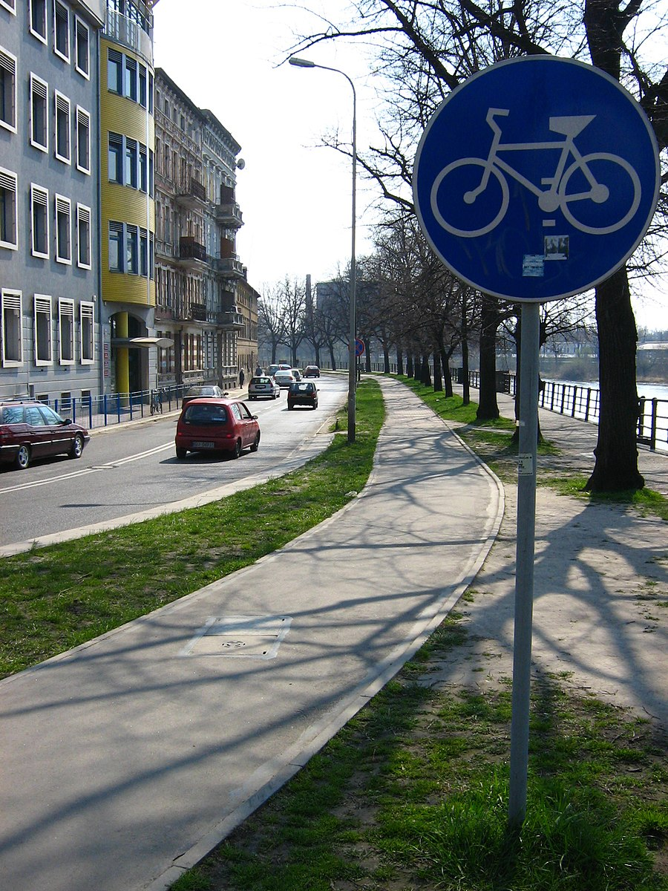
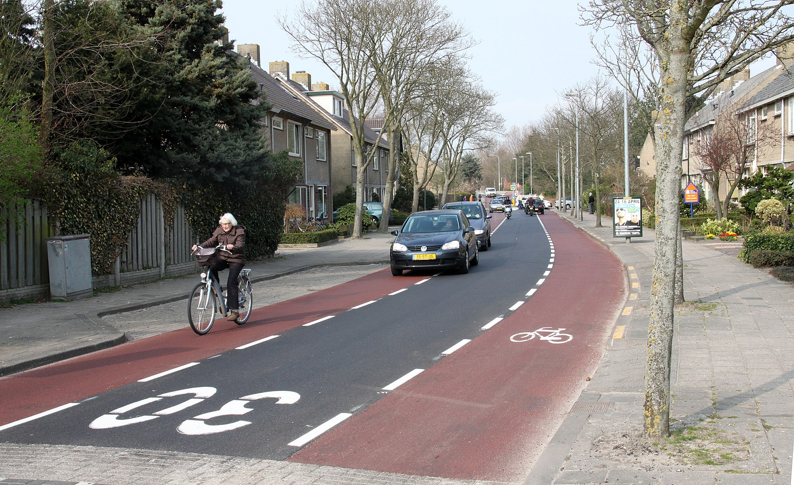

# Reproducible Quality Assessment of OSM Data for Cycling Research

This repository contains a reproducible workflow for assessing the quality of OSM data on cycling infrastructure.

A fair amount of research projects on OSM and other forms of volunteered geographic information (VGI) have already been conducted - but few focus explicitly on cycling infrastructure, although we know that paths and tracks for cyclists and pedestrians often are among the latter features to be mapped, and once they do, are more likely to have errors ([Barron et al., 2014](https://onlinelibrary.wiley.com/doi/10.1111/tgis.12073), [Neis et al. 2012](https://www.mdpi.com/1999-5903/4/1/1)). Moreover, the location of errors and dips in data quality in crowdsourced data are often not random ([Forghani and Delavar, 2014](https://www.mdpi.com/2220-9964/3/2/750)), which necessitates a critical stance towards the data we use for our research, despite the overall high quality of OSM.

The goal behind this workflow is to give researchers and others working with OSM data for research centred on cycling networks an a method for getting a quick overview of the OSM data quality in a given area.

'Data quality' covers a wide range of aspects. The conceptualisation of data quality used here is what is refered to as 'fitness-for-purpose' ([Barron et al., 2014](https://onlinelibrary.wiley.com/doi/10.1111/tgis.12073)) - this means that data quality is interpreted as whether or not the data fulfils the user needs, rather than any unversal definition of quality. We do research based on networks, which means that we are particularly interested in the cores structure of the cycling infrastructure in OSM, data topology, and the data coverage.

The purpose is not to give any final assessment of the data quality, but to highlight aspects that might be relevant for assessing whether the data for a given area is fit for use. While the workflow does make use of a reference data set for comparison, if one is available, the ambition is not to give any final assessment of the quality of OSM compared to the reference data. OSM data on cycling infrastructure is often at a comparable or higher quality than government data sets, and the interpretation of differences between the two thus requires some local knowledge.

**The repository contains 4 elements:**

1. **Data processing:** This notebook downloads data from OSM and processes it to the format needed for the analysis. If any reference data is provided, it will also be converted to a simplified network format here.

2. **Intrinsic analysis:** These notebooks evaluates quality of respectively the OSM and reference data in the study area from the perspective of cycling research. We look at aspects such as missing tags (OSM only), unconnected components, and network gaps (future editions of the OSM intrinsic analysiswill also look athistory of OSM edits and contributor meta data). That the analysis is intrinsic means that we do not compare it with another data set in this step, but only look at properties of the data itself.

3. **Extrinsic analysis:** The third notebook evolves around a extrinsic comparison of the OSM data with a reference data set. The analysis looks at for example differences in network density and structure, and differing connectivity across the study area.

4. **Feature Matching**. The fourth notebook contains functionality for matching corresponding features in the reference and the OSM data. This step is more computationally expensive, but gives an excellent overview of different geometries and/or errors of missing or excess data.

5. **Summary of extrinsinc analysis:** This notebook summarises the findings from notebook 2 & 3 to a final report, that can be used for assessing the data quality of the OSM and, if available, the reference data.

---

## How to use the workflow

The intrinsic and extrinsic notebooks can be run independently, but you must run `load_data.ipynb` first.

To get the full summary report, all notebooks must be run.

*ILLUSTRATION OF WORKFLOW MISSING.*

<!-- INSERT ILLUSTRATION OF WORKFLOW FROM PAPER HERE -->

<!-- 
Install environment 
Fill out configs
If no reference data: run intrinsic osm notebook

If reference data:
- Run intrinsic osm notebook
- Run intrinsic ref notebook
- Run extrinsic notebook
- Run extrinsic feature matching
- Run extrinsic summary  -->

### Setting up the Python environment

To ensure that all packages needed for the analysis are installed, we recommend creating a new conda environment using the `environment.yml`.

The repository has been set up using the structure described in the [Good Research Developer](https://goodresearch.dev/setup.html). Once the folders have been downloaded, navigate to the main folder in a terminal window and run the command `pip install -e .` (If you are having problems accessing functions located in the src folder, this step probably wasn't run successfully).

### Input requirements

To run the analysis, the user must:

- Provide a **polygon** defining the study area (see config.yml for accepted formats)
- Update the **config.yml** with settings for how to run the analysis (see below for details)
- If the extrinsic analysis is to be performed, a **reference data set** must be provided

### Reference data

The reference dataset must be in a format readable by GeoPandas (e.g. GeoPackage, GeoJSON, Shapefile etc.)

For the code to run without errors, the data must:

- only contain cycling infrastructure (i.e. not also the regular street network)
- have all geometries as **LineStrings** (not MultiLineString)
- for each row, the geometry should be a straight LineString only defined by its start- and end nodes
- have start/end nodes at intersections
- be in a CRS recognised by GeoPandas
- contain a column describing whether each feature[^1] is a physically **protected**/separated infrastructure or if it is **unprotected**
- contain a column describing whether each feture is bidirectional or not (see below for details)
- contain a column describing how features have been digitized ('geometry type') (see below for details)

For an example of how a municipal dataset with cycling infrastructure can be converted to the above format, see the notebook [reference_data_preparation](examples/reference_data_preparation.ipynb).

### Configuration file

The configuration file `config.yml` contains a range of settings needed for adapting the analysis to different areas and types of reference data.
Below is an explanation of the settings that are not completely intuitive.

#### **Custom filter**

In the config.yml we provide one way of getting the designated cycling infrastructure from OSM data. What is considered cycling infrastructure - and how it is tagged in OSM - is however highly contextual. If you want to use your own filter for retrieving cycling infrastructure, set `use_custom_filter` to *True* and provide the custom filter under the `custom_filter` variable. For an example of how it should be formatted, see the provided filter `cycling_infrastructure_queries`.

*Please note that  all ':' in OSM column names are replaced with '_' in the preprocessing of the data.*

#### **Infrastructure type**

Similarly, the config.yml contains a dictionary with queries used to classify all edges as either protected, unprotected or mixed (if there is protected in one side and unprotected in the other side). Update if needed, but note that it should correspond to the queries used to define the cycling infrastructuer - i.e. all edges should be classified as either protected, unprotected or mixed.

#### **Missing tag analysis**

In the intrinsic analysis, one element is to analyse how many edges have values for attributes commonly considered important for evaluating bikefriendliness. If you want to change which tags are analysed, modify the dictionary `missing_tags_analysis`. Please not that the relevant tags might depend on the geometry type (i.e. center line or true geometry, see below).

#### **Incompatible tags analysis**

OSM has guidelines, but no restrictions on how tags can be combined. This sometimes results in contradictory information, for example when a path is both tagged as *'highway=cycleway'* and *'bicycle=dismount'*. We have included a dictionary with a few examples of tag combinations that we consider incomptabile, but more entries can be added.

The dictionary is a nested dictionary, where the first key is a subdictionary with the name of the column - e.g. *'cycling_infrastructure'*. The dictionary value for *'cycling_infrastructure'* is the actual value for the column cycling_infrastructure (e.g. *'yes'*), that is considered incompatible with a list of column-value combinations, available as a list of values for the sub-dictionary under *'yes'* as a key.

#### **Reference Geometries**

In the config.yml, the setting `reference_geometries` refers to how the cycling infrastructure have been digitized. In this context we operate with two different scenarios: either the cycling infrastructure has been mapped as an attribute to the center line of the road (this is often done when the cycling infrastructure is running along or are part of a street with car traffic) *or* it has been digitized as it's own geometry.
In the first scenario you will only have one line, even in situations with a cycle track on each side of the street, while two cycletracks on each side will result in two lines in the second scenario.

If a data set only includes one type of mapping cycling infrastructure, you can simply set `reference_geometries` to either *'centerline'* or *'true_geometries'*.

If the data, like OSM, includes a variation of both, the data must contain a column named *'reference_geometris'* with values being either *'centerline'* or *'true_geometries'*, specifying the digitization method for each feature.

The illustration below shows a situation where the same cycling infrastructure have been mapped in two different ways. The blue line is a center line mapping, while the red lines are from a data set that digitizes all cycling infrastructure as individual geometries.

#### **Bidirectional**

Due to the different ways of mapping geometries described above, data sets of the same area will have vastly different lengths if you do not consider that the blue line on the illustration above is bidirectional, while the red lines are not. To enable more accuracte comparisons of length differences, the data must either contain a column *'bidirectional'* with values either True or False, indicating whether each features allows for cycling in both directions or not.
If all features in the reference data set have the same value, you can simply set `bidirectional` as either *True* or *False* in the config.yml.

#### **Cycling infrastructure type**

The cycling infrastructure type simply refers to whether infrastructure is protected (i.e. physically separated from car traffic) or unprotected (e.g. a bike path only marked with paint).

The setting requires a dictionary, `ref_cycling_infrastructure_type` with two entries: `protected` and `unprotected`. For each entry a list of queries should be provided that returns respectively the protected or unprotected infrastructure.

For example, the query `"vejklasse == 'Cykelsti langs vej'"` returns all the protected cycling infrastructure in the test data from GeoDanmark available in the repository.

*Protected cycle track. Attribution: [wiki.openstreetmap](https://wiki.openstreetmap.org/wiki/File:Sciezki_wroclaw_wyspianskiego_1.jpg)*

*Unprotected cycle lane. Attribution: [wiki.openstreetmap](https://wiki.openstreetmap.org/wiki/File:Fietsstrook_Herenweg_Oudorp.jpg)*

---

### Limitations

Although we in the design of the workflow attempt to cover the main aspects of data quality relevant to cycling networks, there are some limitations to the current state of the method. In terms of data modelling, for the sake of simplicity, we make use of an undirected network. This means that it does not contain information about allowed travel directions, assumes movements in each direction on all links and therefore always represent streets and paths with one edge (instead of one for each direction of travel). The current state of the workflow does not make use of routing on the network, but for future iterations travelling directions, as well as including the underlying street network, might be necessary for accurate path computations.

Another limitation touches upon the core purpose of the workflow, and the type of result it can produce: since we do not operate with one data set as ground truth against which another can be evaluated, we cannot conclude where the error lies when differences are identified. For a successful application of the workflow, we thus both expect the user to have some familiarity with OSM data structures and tagging conventions, but also enough knowledge of the study area to evaluate the results independently.

Furthermore we do not directly evaluate the positional accuracy of neither the OSM or the reference data - although a certain level of internal positional accuracy can be deduced from the feature matching. While some level of positional accuracy certainly is of importance, the internal structure and topology is of greater significance for the research questions we are working with.

A final word of caution concerns the use of grid cells for computing local values for quality metrics. While this has the benefit of highlighting spatial variation in potential errors and density of mapped features, it also introduces the problem of the 'modifiable areal unit problem' (MAUP) - meaning that imposing artifical spatial boundaries on our data can distort the results and highlight or disguise patterns based on how we delimit the study area.

---

## Demonstration

To see how the workflow might be used, see the notebooks in the 'Examples' folder.

---

## Get in touch!

Do you have any suggestions for additional metrics or ways to improve the workflow?
Reach us at anev@itu.dk (Ane Rahbek Vierø) or anevy@itu.dk (Anastasia Vybornova).

---

## Data & Licenses

The repository includes test data from the following sources:

### OpenStreetMap

© OpenStreetMap contributors

License: [Open Data Commons Open Database License](https://opendatacommons.org/licenses/odbl/)

### GeoDanmark

© SDFE ( Styrelsen for Dataforsyning og Effektivisering og Danske kommuner)

License: [GeoDanmark](https://www.geodanmark.dk/wp-content/uploads/2020/03/Vilk%C3%A5r-for-brug-af-frie-geografiske-data.pdf)

### City of Copenhagen*

© Københavns Kommune

License: [Open Data DK](https://www.opendata.dk/open-data-dk/open-data-dk-licens)

**Our code is free to use and repurpose under the [CC BY-SA 4.0 license](https://creativecommons.org/licenses/by-sa/4.0/)**

[^1]: We use the word 'feature' to refer to a network edge. Each row in the network edge geodataframes thus represents one feature.
