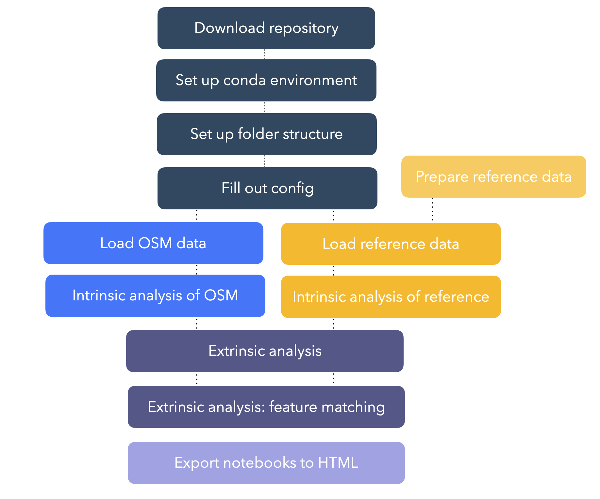

# Reproducible Quality Assessment of Bicycle Network Data

This repository contains a reproducible workflow for assessing the quality of OSM data on bicycle infrastructure. The aim is to provide researchers and others who work with OSM data for research centered on bicycle networks an informed overview of the OSM data quality in a given area.

A fair amount of research projects on OpenStreetMap (OSM) and other forms of volunteered geographic information (VGI) have already been conducted, but few focus explicitly on bicycle infrastructure. Doing so is important because paths and tracks for cyclists and pedestrians often are mapped last and are more likely to have errors ([Barron et al., 2014](https://onlinelibrary.wiley.com/doi/10.1111/tgis.12073), [Neis et al. 2012](https://www.mdpi.com/1999-5903/4/1/1)). Moreover, the spatial distribution of errors and dips in data quality in crowdsourced data are often not random but correlate with population density and other characteristics of the mapped area ([Forghani and Delavar, 2014](https://www.mdpi.com/2220-9964/3/2/750)), which necessitates a critical stance towards the data we use for our research, despite the overall high quality of OSM.

'Data quality' covers a wide range of aspects. The conceptualization of data quality used here is what is referred to as 'fitness-for-purpose' ([Barron et al., 2014](https://onlinelibrary.wiley.com/doi/10.1111/tgis.12073)) - this means that data quality is interpreted as whether or not the data fulfils the user needs, rather than any universal definition of quality. To particularly support network-based research, this workflow provides insights into the topological structure of the bicycle network apart from data coverage.

The purpose is not to give any final assessment of the data quality, but to highlight aspects that might be relevant for assessing whether the data for a given area is fit for use. While the workflow does make use of a reference dataset for comparison, if one is available, the ambition is not to give any final assessment of the quality of OSM compared to the reference data. OSM data on bicycle infrastructure is often at a comparable or higher quality than government datasets, and the interpretation of differences between the two thus requires some local knowledge.

## Technical requirements
To run the workflow, an installation of [Python](https://www.python.org/downloads/), including tools for [Jupyter notebook](https://jupyter.org/install), is required. 

## Workflow structure

The workflow is divided into 3 elements: **OSM**, aimed at analyzing OpenStreetMap data, **reference**, designed for evaluating non-osm bicycle network data, and **comparison**, for comparing OSM and reference data.

The OSM and reference elements can be run independently, but for comparing the data, the notebooks for processing both OSM and reference data must be run first.

### Notebooks

All analysis notebooks are in the *scripts* folder.

#### OSM

- **[01a_load_osm](https://github.com/anerv/cycling_data_quality/blob/main/scripts/OSM/01a_load_OSM.ipynb):** This notebook downloads data from OSM, processes it to the format needed in the analysis.

- **[02a_intrinsic_analysis_osm](https://github.com/anerv/cycling_data_quality/blob/main/scripts/OSM/02a_intrinsic_analysis_OSM.ipynb):** The intrinsic analyses evaluates the quality of the OSM in the study area from the perspective of bicycle research. This evaluation includes, for example, missing tags, disconnected components, and network gaps. *Intrinsic* means that the dataset is analyzed for itself without being compared to other data.

#### REFERENCE

- **[01b_load_reference](https://github.com/anerv/cycling_data_quality/blob/main/scripts/REFERENCE/01b_load_REF.ipynb):** This notebook processes the provided reference data to the format needed in the analysis.

- **[02b_intrinsic_analysis_reference](https://github.com/anerv/cycling_data_quality/blob/main/scripts/REFERENCE/02b_intrinsic_analysis_REF.ipynb):** The intrinsic analyses evaluates the quality of the OSM in the study area from the perspective of bicycle research. This evaluation includes, for example, disconnected components and network gaps. *Intrinsic* means that the dataset is analyzed for itself without being compared to other data.

#### COMPARE

- **[03a_extrinsic_analysis_metrics](https://github.com/anerv/cycling_data_quality/blob/main/scripts/COMPARE/03a_extrinsic_analysis_metrics.ipynb):** The extrinsic analysis compares the results computed in the intrinsic analysis of the OSM and reference data. The analysis considers for example differences in network density and structure, and differing connectivity across the study area.
- **[03b_extrinsic_analysis_feature_matching](https://github.com/anerv/cycling_data_quality/blob/main/scripts/COMPARE/03b_extrinsic_analysis_feature_matching.ipynb):** The fourth notebook contains functionality for matching corresponding features in the reference and OSM data. This step is more computationally expensive but gives an excellent overview of different geometries and/or errors of missing or excess data.

---

## How to use the workflow

After setting up the environment and folder structure and filling out the configurations, the notebooks for OSM data (<span style="color:blue;">blue</span>) and the notebooks for the reference data (<span style="color:orange;">orange</span>) can be run independently[^1], but both must be run before the extrinsic analysis can be performed.

Once the desired parts of the analysis have been completed, the notebooks including the resulting plots can be exported to HTML.

<div style='text-align: center;'>



</div>

For an example of how the workflow can be used, see the notebooks in the 'examples' folder.

### 1. Download repository

*insert explanation here*

### 2. Set up the Python conda environment 

To ensure that all packages needed for the analysis are installed, it is recommended to create and activate a new conda environment using the `environment.yml`:

```
conda env create --file=environment.yml
conda activate cdq
```

If this fails, the environment can be created by running:

```
conda config --prepend channels conda-forge
conda create -n cdq_new --strict-channel-priority osmnx geopandas pandas networkx folium pyyaml matplotlib contextily jupyterlab haversine momepy nbconvert ipykernel
conda activate cdq_new
```

*This method does however not control the library versions and should only be used as the last option.*

The repository has been set up using the structure described in the [Good Research Developer](https://goodresearch.dev/setup.html). Once the repository has been downloaded, navigate to the main folder in a terminal window and run the command

```
pip install -e .
```

Lastly, add the environment kernel to Jupyter via:

```
python -m ipykernel install --user --name=cdq
```

### 3. Set up the folder structure 

Next, to create the folder structure required by the workflow, navigate to the main folder in a terminal window and run the Python file `setup_folders.py`

```
python setup_folders.py
```

This should return:

```
Successfully created folder data/osm/'my_study_area'/
Successfully created folder data/reference/'my_study_area'/
Successfully created folder data/compare/'my_study_area'/
...
```

### 4. Provide data sets

Once the folders have been created, provide:

- a **polygon** in `gpkg` format defining the study area: `/data/study_area_polygon/'my_study_area'/study_area_polygon.gpkg`. **Note**: If a different file name or file extension is used, the file paths in notebooks 01a and 01b must be updated. The file must be in a format readable by [GeoPandas](https://geopandas.org/en/stable/docs/user_guide/io.html) (e.g., GeoPackage, GeoJSON, Shapefile etc.).
- if the extrinsic analysis is to be performed, a reference dataset: `/data/reference/'my_study_area'/raw/reference_data.gpkg` (if an analysis of reference data is to be performed)

**Reference data input requirements**

The reference datase must be a GeoPackage called `reference_data.gpkg`.  If a different file name or file extension is used, the file path in notebook 01b must be updated. The file must be in a format readable by [GeoPandas](https://geopandas.org/en/stable/docs/user_guide/io.html) (e.g., GeoPackage, GeoJSON, Shapefile etc.). 

For the code and the analysis to run without errors, the data must:

- only contain **bicycle infrastructure** (i.e. not also the regular street network)
- have all geometries as **LineStrings** (not MultiLineStrings)
- have **all intersections** represented as LineString endpoints
- be in a **CRS** recognized by GeoPandas
- contain a column describing whether each feature[^2] is a physically **protected**/separated infrastructure or if it is **unprotected**
- contain a column describing whether each feature is **bidirectional** or not (see below for details)
- contain a column describing how features have been digitized (**'geometry type'**) (see below for details)
- contain a column with a unique **ID** for each feature

For an example of how a municipal dataset with bicycle infrastructure can be converted to the above format, see the notebooks [reference_data_preparation_01](examples/reference_data_preparation_01.ipynb) and [reference_data_preparation_02](examples/reference_data_preparation_02.ipynb).

### 5. Fill out the configuration file

In order to run the code, the configuration file `config.yml` must be filled out. The configuration file contains a range of settings needed for adapting the analysis to different areas and types of reference data. 

#### **Custom filter**

The queries in `config.yml` provides one way of getting the designated bicycle infrastructure from OSM data. What is considered bicycle infrastructure - and how it is tagged in OSM - is however highly contextual. If you want to use your own filter for retrieving bicycle infrastructure, set `use_custom_filter` to *True* and provide the custom filter under the `custom_filter` variable. For an example of how it should be formatted, see the provided filter `bicycle_infrastructure_queries`.

*Please note that  all ':' in OSM column names are replaced with '_' in the preprocessing of the data to enable using pandas.query without errors.*

#### **Infrastructure type**

Similarly, the `config.yml` contains a dictionary with queries used to classify all edges as either protected, unprotected or mixed (if there is protected in one side and unprotected in the other side). Update if needed, but note that it should correspond to the queries used to define the bicycle infrastructure - i.e., all edges must be classified as either protected, unprotected or mixed.

#### **Missing tag analysis**

In the intrinsic analysis, one element is to analyze how many edges have values for attributes commonly considered important for evaluating bike friendliness. If you want to change which tags are analyzed, modify the dictionary `missing_tags_analysis`. Please note that the relevant tags might depend on the geometry type (i.e. center line or true geometry, see below).

#### **Incompatible tags analysis**

OSM has guidelines, but no restrictions on how tags can be combined. This sometimes results in contradictory information, for example when a path is both tagged as *'highway=cycleway'* and *'bicycle=dismount'*. The default configuration includes a dictionary with a few examples of tag combinations that we consider incompatible, but more entries can be added.

The dictionary is a nested dictionary, where the first key is a sub-dictionary with the name of the column - e.g., *'bicycle_infrastructure'*. The dictionary value for *'bicycle_infrastructure'* is the actual value for the column bicycle_infrastructure (e.g., *'yes'*), that is considered incompatible with a list of column-value combinations, available as a list of values for the sub-dictionary under *'yes'* as a key.

#### **Reference Geometries**

In the *config.yml*, the setting `reference_geometries` refers to how the bicycle infrastructure have been digitized. The analysis operates with two different scenarios: either the bicycle infrastructure has been mapped as an attribute to the center line of the road (this is often done when the bicycle infrastructure is running along or are part of a street with car traffic) *or* it has been digitized as its own geometry.
In the first scenario you will only have one line, even in situations with a cycle track on each side of the street, while two cycle tracks on each side will result in two lines in the second scenario.

If a dataset only includes one type of mapping bicycle infrastructure, you can simply set `reference_geometries` to either *'centerline'* or *'true_geometries'*.

If the data, like OSM, includes a variation of both, the data must contain a column named *'reference_geometris'* with values being either *'centerline'* or *'true_geometries'*, specifying the digitization method for each feature.

The illustration below shows a situation where the same bicycle infrastructure has been mapped in two different ways. The blue line is a center line mapping, while the red lines are from a dataset that digitizes all bicycle infrastructure as individual geometries.

<div style='text-align: center;'></div>

#### **Bidirectional**

Due to the different ways of mapping geometries described above, datasets of the same area will have vastly different lengths if you do not consider that the blue line on the illustration above is bidirectional, while the red lines are not. To enable more accurate comparisons of length differences, the data must either contain a column *'bidirectional'* with values either True or False, indicating whether each feature allows for bicycle in both directions or not.
If all features in the reference dataset have the same value, you can simply set `bidirectional` as either *True* or *False* in the `config.yml`.

<div style='text-align: center;'></div>

#### **Bicycle infrastructure type**

The 'bicycle infrastructure' type simply refers to whether infrastructure is protected (i.e. physically separated from car traffic) or unprotected (e.g. a bike path only marked with paint).

The setting requires a dictionary, `ref_bicycle_infrastructure_type` with two entries: `protected` and `unprotected`. For each entry a list of queries must be provided that returns respectively the protected or unprotected infrastructure.

For example, the query `"vejklasse == 'Cykelsti langs vej'"` returns all the protected bicycle infrastructure in the test data from GeoDanmark available in the repository.

<div style='text-align: center;'>


*Protected cycle track. Attribution: [wiki.openstreetmap](https://wiki.openstreetmap.org/wiki/File:Sciezki_wroclaw_wyspianskiego_1.jpg)*

</div>

<div style='text-align: center;'>


*Unprotected cycle lane. Attribution: [wiki.openstreetmap](https://wiki.openstreetmap.org/wiki/File:Fietsstrook_Herenweg_Oudorp.jpg)*

</div>

### 6. Run the notebooks

After completing steps 1.-4., the notebooks with the code can be run. The notebooks for intrinsic analysis of OSM and reference data are independent from each other and can be run separately. 
* For intrinsic analysis of OSM data: run 01a, then 02a from the `scripts/OSM` folder
* For intrinsic analysis of reference data: run 01b, then 02b from the `scripts/REF` folder
* For an extrinsic analysis comparing OSM to reference data, complete the intrinsic analysis for both OSM and reference data (in any order), and then run 03a and 03b from the `scripts/COMPARE` folder

### 7. Export the results

All notebooks will produce a number of figures and results, saved in the `results` folder.

To export the notebooks including the explanations and plots but without the code, navigate to the main folder in a terminal window and run:

```
sh export_notebooks.sh
```

This will generate all notebooks as HTML files.

*Please note: If you are doing the analysis for multiple study areas or with several parameter settings and wish to generate HTML reports for each instance, the notebooks must be exported each time.*

---

## Limitations

The workflow uses OSMnx to load OSM data and includes some elements (like feature matching) that are computationally expensive. For analysis of bigger areas (e.g., regions or countries), it is recommended to use for example [Pyrosm](https://pyrosm.readthedocs.io/en/latest/) for creating street networks from OSM data (not included in the repository for now).

Although the content of the workflow attempts to cover the main aspects of data quality relevant to bicycle networks, there are some limitations to the current state of the method. In terms of data modelling, for the sake of simplicity, it makes use of an undirected network. This means that it does not contain information about allowed travel directions, assumes movements in each direction on all links and therefore always represent streets and paths with one edge (instead of one for each direction of travel). The current state of the workflow does not make use of routing on the network, but for future iterations travelling directions, as well as including the underlying street network, might be necessary for accurate path computations.

Another limitation touches upon the core purpose of the workflow, and the type of result it can produce: since the analysis does not operate with one dataset as ground truth against which another can be evaluated, it cannot be concluded where the error lies when differences are identified. For a successful application of the workflow, it is thus both expected that the user has some familiarity with OSM data structures and tagging conventions, but also enough knowledge of the study area to evaluate the results independently.

Furthermore, the positional accuracy of the OSM and the reference data are not directly evaluated - although a certain level of internal positional accuracy can be deduced from the feature matching. While some level of positional accuracy certainly is of importance, the internal structure and topology is of greater significance for the type of research this quality assessment is designed for (i.e., research with a system-wide focus on connections and accessibility).

A final word of caution concerns the use of grid cells for computing local values for quality metrics. While this has the benefit of highlighting spatial variation in potential errors and density of mapped features, it also introduces the problem of the *modifiable areal unit problem* (MAUP) - meaning that imposing artificial spatial boundaries on our data can distort the results and highlight or disguise patterns based on the study area is delimited.

---

## Demonstration

To see how the workflow might be used, see the notebooks in the 'Examples' folder.

---

## Get in touch

Do you have any suggestions for additional metrics or ways to improve the workflow?
Reach us at anev@itu.dk (Ane Rahbek Vierø) or anvy@itu.dk (Anastassia Vybornova).

---

## Data & Licenses

The repository includes test data from the following sources:

### OpenStreetMap

© OpenStreetMap contributors

License: [Open Data Commons Open Database License](https://opendatacommons.org/licenses/odbl/)

### GeoDanmark

Contains data from GeoDanmark (retrieved spring 2022)
© SDFE (Styrelsen for Dataforsyning og Effektivisering og Danske kommuner)

License: [GeoDanmark](https://www.geodanmark.dk/wp-content/uploads/2022/08/Vilkaar-for-brug-af-frie-geografiske-data_GeoDanmark-grunddata-august-2022.pdf)

### City of Copenhagen

© Københavns Kommune

License: [Open Data DK](https://www.opendata.dk/open-data-dk/open-data-dk-licens)

**Our code is free to use and repurpose under the [CC BY-SA 4.0 license](https://creativecommons.org/licenses/by-sa/4.0/)**

[^1]: I.e., the notebooks for loading respectively OSM and reference data must be run *before* the corresponding intrinsic analysis notebook is run but running the OSM notebooks can be done without running the reference notebooks and vice versa.

[^2]: The word 'feature' is used to refer to a network edge. Each row in the network edge GeoDataFrames thus represents one feature.
